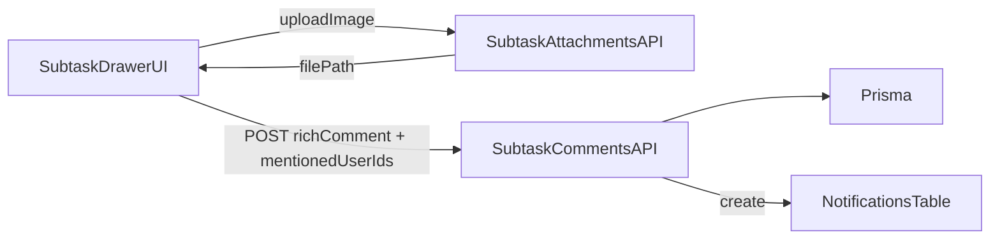

# Nested drawer Subtask + Rich comments

## Obiettivo

- Ripristinare il **Task drawer** in stile **property-grid** (come nelle immagini).
- Reintrodurre un **nested drawer da destra** per la **Subtask** (Task drawer resta aperto sotto).
- Nel drawer Subtask: **commenti rich-text** con **immagini inline** e **@mention** di colleghi che crea una **Notification** con link alla task/subtask.

## Vincoli / Decisioni

- **Persistenza commenti**: salviamo il contenuto come **HTML** nel campo `content` già presente (`TaskComment.content`, `SubtaskComment.content`) per evitare una migration immediata.
- **@mention**: la UI inserisce markup mention (es. `data-mention-user-id`) e invia anche `mentionedUserIds[]` all’API; l’API crea `Notification` per ciascun utente menzionato.
- **Immagini inline**: upload tramite endpoint esistente di attachments subtask, e inserimento di `` nel contenuto rich-text.

## Flusso (alto livello)

## Implementazione (passi)

1. **Ripristino UI property-grid Task + shell nested drawer**

- Reintegrare (in modo selettivo) le modifiche UI precedenti per:
    - `TaskDetailModal` in stile property-grid
    - `Sheet` con supporto a layering (z-index/overlay)
    - wrapper `SideDrawer` per nested drawer
- File principali:
    - [nextjs_space/components/task-detail-modal.tsx](nextjs_space/components/task-detail-modal.tsx)
    - [nextjs_space/components/side-drawer.tsx](nextjs_space/components/side-drawer.tsx)
    - [nextjs_space/components/ui/sheet.tsx](nextjs_space/components/ui/sheet.tsx)

2. **Nested drawer Subtask (da destra)**

- Dal tab/subtasks nel Task drawer: click su subtask -> apre `SideDrawer` annidato.
- Contenuti drawer Subtask:
    - header: titolo + status/priority/due date/assignee (come screenshot)
    - description editor
    - checklists (se abilitate)
    - attachments
    - comments rich-text

3. **Rich-text editor per commenti + @mention (con suggestions)**

- Introdurre un editor rich-text (es. TipTap) con:
    - **Mention extension** (suggestions dai membri del progetto)
    - **Image extension** (inserimento immagine dopo upload)
- Creare componente riusabile:
    - `nextjs_space/components/ui/rich-text-editor.tsx` (nuovo)
- Rendering commenti: usare lo stesso motore (read-only) o sanitizzazione HTML.

4. **API: commenti Subtask con mentions + notifica**

- Estendere [nextjs_space/app/api/tasks/[id]/subtasks/[subtaskId]/comments/route.ts](nextjs_space/app/api/tasks/[id]/subtasks/[subtaskId]/comments/route.ts)
    - accettare `contentHtml` (o `content`) + `mentionedUserIds: string[]`
    - creare `Notification` per gli utenti menzionati (escludendo autore)
    - generare un `link` coerente (task/subtask) per aprire il drawer corretto
- Compatibilità: se arriva `content` semplice, continua a funzionare.

5. **Upload immagine inline (riuso attachments subtask)**

- Dal rich editor: su paste/drag o pulsante "Image" -> upload via
    - `POST /api/tasks/:id/subtasks/:subtaskId/attachments`
- Il response ritorna `filePath` (Drive URL) e l’editor inserisce ``.

6. **Test (integrazione API)**

- Aggiungere/estendere test accanto alle route:
    - `.../comments/route.test.ts` per verificare:
    - create comment con `mentionedUserIds` => crea notification
    - sanitize/validation base

## File toccati (previsti)

- UI:
- [nextjs_space/components/task-detail-modal.tsx](nextjs_space/components/task-detail-modal.tsx)
- [nextjs_space/components/side-drawer.tsx](nextjs_space/components/side-drawer.tsx)
- [nextjs_space/components/ui/sheet.tsx](nextjs_space/components/ui/sheet.tsx)
- [nextjs_space/components/subtask-checklists.tsx](nextjs_space/components/subtask-checklists.tsx)
- `nextjs_space/components/ui/rich-text-editor.tsx` (nuovo)
- API:
- [nextjs_space/app/api/tasks/[id]/subtasks/[subtaskId]/comments/route.ts](nextjs_space/app/api/tasks/[id]/subtasks/[subtaskId]/comments/route.ts)
- [nextjs_space/app/api/notifications/route.ts](nextjs_space/app/api/notifications/route.ts) (solo se serve estendere payload)
- Tests:
- `nextjs_space/app/api/tasks/[id]/subtasks/[subtaskId]/comments/route.test.ts`

## Criteri di accettazione

- Aprendo una task: drawer property-grid a destra.
- Selezionando una subtask: si apre **un secondo drawer da destra** sopra.
- In commenti Subtask:
- si può inserire testo + immagine inline
- `@nome` mostra suggestions (membri progetto) e inserisce mention